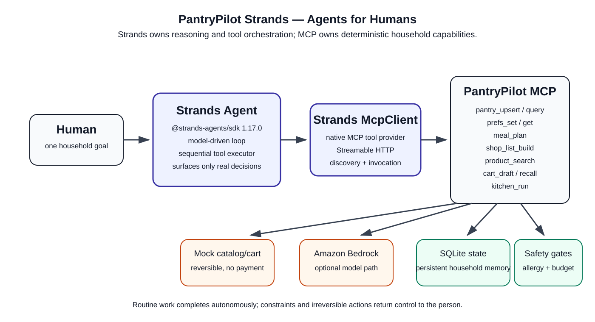

# PantryPilot Strands — Agents for Humans

**Track:** Everyday Agents  
**Hackathon:** AWS Agents for Humans  
**Core requirement:** Strands Agents SDK  

PantryPilot Strands is an autonomous household kitchen-operations agent. Instead of making a person repeatedly reconcile pantry inventory, dietary constraints, meal ideas, missing groceries and cart preparation, a **Strands Agent** connects to the PantryPilot MCP tool server and carries the routine workflow end to end.

The agent is designed to stay quiet during routine work and surface only meaningful decisions such as a blocked allergy path, a budget ceiling, or a request that would require a real irreversible action.

## Why this is a Strands project

This submission uses `@strands-agents/sdk` **1.17.0** as the runtime agent framework, not as a documentation-only dependency.

- `Agent` owns the reasoning/tool loop.
- `McpClient` is passed directly to the Agent as a tool provider.
- PantryPilot's MCP tools become native Strands tools.
- `toolExecutor: 'sequential'` preserves order for workflows whose later actions depend on earlier household state.
- The agent prompt explicitly drives autonomous completion and respects allergen/budget safety gates.
- `src/judge-check.ts` uses Strands' MCP client directly to discover and invoke the tool server without LLM credentials.

## Architecture



Flow:

`Human request -> Strands Agent -> Strands McpClient -> PantryPilot MCP -> SQLite household state / optional Bedrock / catalog -> concise result or decision request`

## Judge quick start

### Prerequisites

- Node.js 22+
- npm

### 1. Start the PantryPilot MCP tool server

From repository root:

```bash
npm ci
npm run build
npm start
```

Health check:

```text
http://127.0.0.1:3000/health
```

### 2. Verify Strands-to-MCP integration without model credentials

In another terminal:

```bash
cd agents-for-humans
npm install
npm run build
npm run judge-check
```

Expected: the Strands `McpClient` connects to `http://127.0.0.1:3000/mcp`, discovers the PantryPilot tool surface and directly invokes `session_recall`.

### 3. Run the real Strands agent

Configure standard AWS credentials with Amazon Bedrock access, then:

```bash
cd agents-for-humans
npm run agent -- "For household demo, plan three days from my pantry, calculate gaps, find suitable products, and prepare a safe mock cart. Do routine work autonomously."
```

The Strands agent decides which connected MCP tools to use. For a complete weekly flow it is instructed to prefer `kitchen_run`, then use `session_recall` when useful to verify persistent state.

Optional endpoint override:

```bash
PANTRYPILOT_MCP_URL=https://your-host.example/mcp npm run agent -- "..."
```

## What it does end to end

1. Remembers pantry inventory.
2. Stores household diet, serving size, allergy and budget preferences.
3. Builds a multi-day meal plan.
4. Calculates ingredient shortages.
5. Finds matching product options.
6. Prepares a reversible mock cart draft.
7. Recalls state in later sessions.
8. Stops/surfaces a decision when safety or budget gates block the workflow.

## Safety boundary

PantryPilot does **not** place a real Amazon order, transfer money, or bypass household constraints. Product/cart behavior remains an intentionally reversible mock workflow for the hackathon.

## Testing

With the MCP server running:

```bash
npm run verify
```

The parent project also provides its own conformance, smoke, eval and safety-gate suite from repository root:

```bash
npm run verify-submission
```

## Pre-existing work disclosure

This submission is transparent about reuse. The underlying PantryPilot MCP/domain project was created on **2026-09-10**, during the Agents for Humans submission period, originally for a separate Amazon developer hackathon. The **Strands orchestration layer, Strands MCP integration, judge checks, architecture and Agents for Humans submission materials were created for this submission on 2026-09-11**.

See [`PREEXISTING.md`](./PREEXISTING.md) for the exact boundary.

## License

The repository root is MIT licensed. The Strands SDK dependency is Apache-2.0 licensed.
